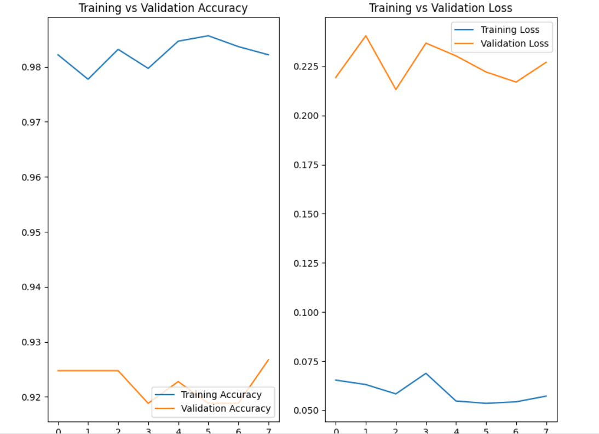
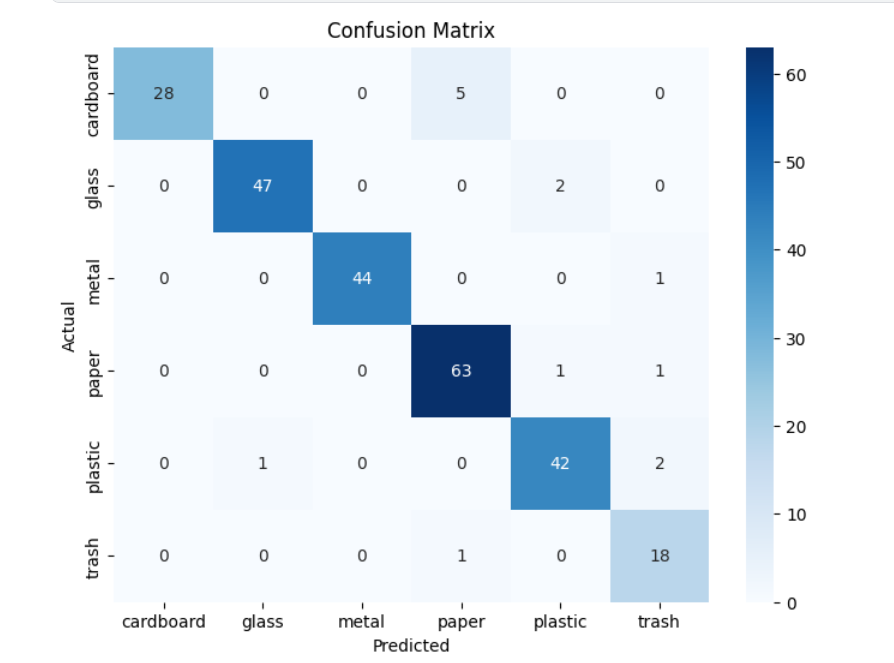
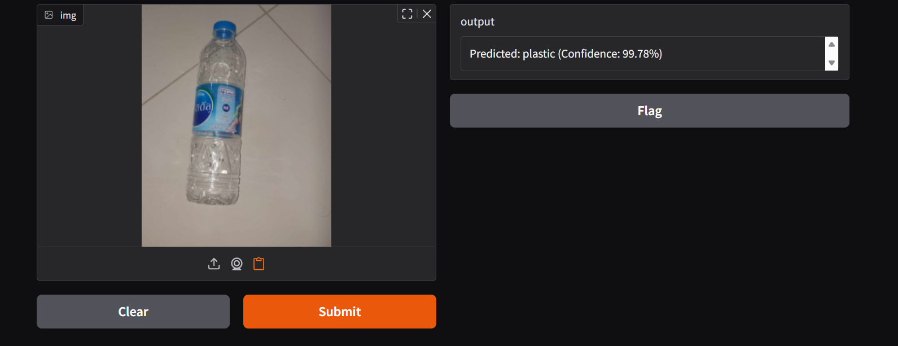

# Smart Waste Management System ♻️

## Overview

Smart Waste Management System is an AI-powered image classification project that identifies waste materials and categorizes them into six classes:

* Cardboard
* Glass
* Metal
* Paper
* Plastic
* Trash

The project uses Transfer Learning with EfficientNetV2B2 to classify waste images and assist in better waste segregation and recycling practices.

---

## Features

* Waste Classification using Deep Learning
* Transfer Learning with EfficientNetV2B2
* Data Augmentation for improved generalization
* Class Weight Balancing for imbalanced datasets
* Confusion Matrix Analysis
* Classification Report with Precision, Recall, and F1-Score
* Misclassified Image Analysis
* Interactive Gradio Interface

---

## Dataset

The model was trained on a waste image dataset containing six waste categories:

| Class     |
| --------- |
| Cardboard |
| Glass     |
| Metal     |
| Paper     |
| Plastic   |
| Trash     |

---

## Model Architecture

* Backbone: EfficientNetV2B2
* Input Size: 224 × 224
* Transfer Learning: ImageNet Weights
* Optimizer: Adam
* Loss Function: Sparse Categorical Crossentropy
* Data Augmentation: Flip, Rotation, Zoom, Contrast, Translation

---

## Results

### Performance

* Validation Accuracy: **92.67%**
* Precision: **92.7%**
* Recall: **92.7%**
* F1 Score: **92.7%**

### Training Curves



### Confusion Matrix



### Sample Predictions



---

## Error Analysis

Most classification errors occurred between visually similar categories such as:

* Cardboard ↔ Paper
* Plastic ↔ Trash
* Glass ↔ Plastic

The model performs strongly on distinct materials while struggling mainly with ambiguous or partially visible objects.

---

## Technologies Used

* Python
* TensorFlow / Keras
* EfficientNetV2B2
* NumPy
* Matplotlib
* Seaborn
* Scikit-Learn
* Gradio

---

## Project Structure

```text
smart-waste-management
│
├── notebook/
├── app/
├── images/
├── requirements.txt
├── README.md
└── .gitignore
```

---

## Future Improvements

* Deploy as a web application
* Real-time camera-based waste detection
* Waste disposal recommendations
* Mobile application integration

---

## Author

Jyoti

